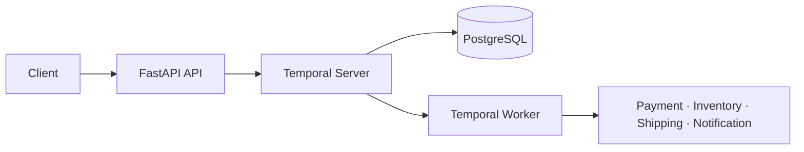

# Order Fulfillment Service

A reliable order-processing backend built with **Temporal, FastAPI, PostgreSQL, and Docker**.

This project demonstrates how a multi-step backend workflow can **survive worker restarts, retry transient failures, distinguish business failures, compensate partially completed work, and remain observable throughout execution**.

[](https://github.com/gabbyb-cloud/order-fulfillment-temporal/actions/workflows/ci.yml)

> **Reliability focus:** Persist state → Classify failure → Retry safely → Compensate when necessary → Resume execution → Verify behavior

---

## Reliability at a Glance

| Reliability concern | Implementation |
| --- | --- |
| Worker crash | Temporal preserves workflow history so execution can continue after restart |
| Transient infrastructure failure | Bounded retries with exponential backoff |
| Business failure | Invalid cards, unavailable inventory, and invalid addresses are treated as non-retryable |
| Partial completion | Saga-style compensation reverses completed work in the appropriate order |
| Cancellation | Workflow compensates completed steps at safe checkpoints and prevents later work |
| API access | FastAPI endpoints require an environment-configured API key |
| Observability | Structured activity events are correlated with order and execution context |
| Verification | Automated workflow/API tests run through GitHub Actions |
| Reproducibility | Five-service Docker Compose environment |

The goal is not only to complete the happy path. The project focuses on what happens when execution is interrupted or a downstream step fails after earlier work has already succeeded.

---

## Architecture



The API starts a workflow and returns immediately. Temporal owns the longer-running execution while the worker performs each activity.

This separates request handling from durable workflow execution so a worker process does not have to remain alive for the order state to survive.

---

## Workflow

The workflow coordinates:

1. Payment validation
2. Inventory reservation
3. Shipping
4. Customer notification

```text
Order submitted
      |
      v
Validate payment
      |
      v
Reserve inventory
      |
      v
Create shipment
      |
      v
Send notification
      |
      v
Completed
```

Each step is treated as part of a longer-running process rather than a single synchronous request.

---

## Failure Handling

### Transient failures

Retryable infrastructure failures use bounded retries with exponential backoff.

This allows short-lived failures to recover without immediately failing the entire workflow.

### Business failures

Conditions such as:

- invalid payment details
- unavailable inventory
- invalid shipping addresses

are classified as non-retryable business failures.

Retrying these conditions would not make them succeed, so they are handled differently from transient infrastructure problems.

### Partial completion

If a later step fails after earlier work has succeeded, compensation occurs in reverse order.

```text
Payment completed
      |
Inventory reserved
      |
Shipping fails
      |
      v
Release inventory
      |
      v
Refund payment
```

This is a Saga-style recovery model: completed actions have compensating actions rather than relying on one distributed transaction.

### Cancellation

Cancellation is processed at safe workflow checkpoints.

If work has already completed, the workflow compensates those actions. If a later activity has not started, cancellation prevents that work from proceeding.

---

## Crash Recovery

A controlled crash-recovery exercise verifies that workflow state survives a worker interruption.

```text
Workflow running
      |
      v
Worker stops
      |
      v
Workflow history remains durable
      |
      v
Worker restarts
      |
      v
Execution resumes
```

The important reliability property is that workflow progress is stored independently of the worker process.

A worker restart therefore does not require rebuilding workflow state from memory or restarting the order from the beginning.

---

## Engineering Focus

- Durable workflow execution
- Retry policy design
- Failure classification
- Saga compensation
- Crash recovery
- Safe cancellation
- Backend API boundaries
- Structured operational events
- Automated reliability testing
- Reproducible local infrastructure

---

## Verified Results

| Check | Result |
| --- | ---: |
| Automated tests | 11 passing |
| Authenticated benchmark requests | 25 / 25 successful |
| Average submission latency | 38.74 ms |
| p95 submission latency | 75.51 ms |

The automated suite includes checks for shipping-failure compensation and cancellation at the checkpoints after payment and inventory reservation.

These tests verify compensation order and confirm that cancellation prevents subsequent inventory reservation or shipping where appropriate.

The benchmark numbers are from an example local run executed inside the API container against the Docker Compose stack.

The run used 25 sequential authenticated requests and measured **order submission latency**, not complete workflow duration or production-scale throughput.

Results vary with hardware, system load, and execution environment.

---

## What the Tests Verify

The test suite focuses on workflow behavior, not only endpoint responses.

Examples include:

- successful order execution
- retry behavior for transient failures
- non-retryable business failures
- shipping-failure compensation
- cancellation after payment
- cancellation after inventory reservation
- authenticated API behavior
- workflow status queries

The purpose is to verify that failure handling behaves predictably when the workflow leaves the happy path.

---

## Technology

**Python 3.13 · FastAPI · Pydantic · Temporal Python SDK · PostgreSQL · Docker Compose · pytest · GitHub Actions**

---

## Run Locally

### Requirements

- Python 3.13
- Docker Desktop
- Git

### Setup

```bash
git clone https://github.com/gabbyb-cloud/order-fulfillment-temporal.git
cd order-fulfillment-temporal
cp .env.example .env
docker compose up --build -d
```

Services:

- API: `http://localhost:8000`
- Temporal UI: `http://localhost:8080`

Run the tests:

```bash
python -m pip install -r requirements.txt
python -m pytest -q
```

Stop the environment:

```bash
docker compose down
```

---

## API

All endpoints require an `X-API-Key` header.

| Method | Endpoint | Purpose |
| --- | --- | --- |
| `POST` | `/orders` | Start an order workflow |
| `GET` | `/orders/{order_id}` | Query workflow status |
| `POST` | `/orders/{order_id}/cancel` | Request cancellation |
| `GET` | `/health` | Check API health |

---

## Engineering Takeaways

### Durable state changes failure recovery

If workflow progress exists only in a worker's memory, a process crash can become a workflow failure. Persisted workflow history allows execution to resume instead.

### Not every failure should be retried

Infrastructure problems and business-rule failures require different responses. Retrying a temporarily unavailable dependency may help; retrying an invalid address usually will not.

### Partial success needs an explicit recovery strategy

Multi-step operations can fail after earlier steps succeed. Compensation provides a controlled way to reverse those completed actions.

### Recovery behavior should be tested directly

Failure recovery, cancellation, and compensation are part of the system's behavior and deserve automated tests just like the successful path.

---

## Project Boundaries

This is a focused engineering project rather than a production commerce system.

Payment, inventory, shipping, and notification activities are intentionally simulated so the project can focus on workflow durability and failure handling.

Production extensions would include:

- real external service integrations
- stronger end-to-end idempotency guarantees
- managed identity and secrets
- distributed tracing
- production alerting
- higher-volume load testing
- dependency-specific SLOs

See [DESIGN.md](DESIGN.md) for the complete workflow design, retry policies, compensation rules, cancellation behavior, and engineering trade-offs.

---

## Engineering Focus

This project demonstrates a core reliability principle:

**successful systems are not defined only by what happens when everything works—they are also defined by how predictably they recover when it does not.**
