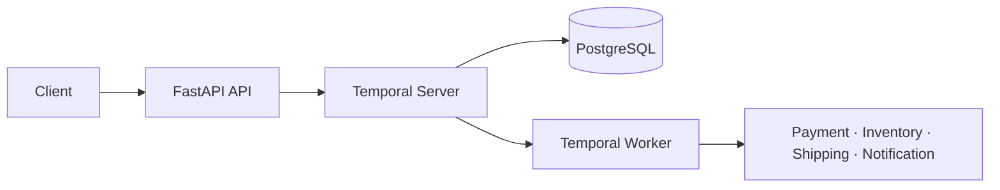

# Order Fulfillment Service

A reliable order-processing backend built with **Temporal, FastAPI, PostgreSQL, and Docker**.

This project demonstrates how a multi-step workflow can recover from transient failures, distinguish business errors, compensate completed work, survive worker restarts, and remain observable throughout execution.

[](https://github.com/gabbyb-cloud/order-fulfillment-temporal/actions/workflows/ci.yml)

## Engineering focus

| Capability | Implementation |
| --- | --- |
| Durable execution | Temporal preserves workflow state across worker restarts |
| Failure handling | Retryable infrastructure failures are separated from non-retryable business errors |
| Compensation | Saga actions refund payment and release inventory after partial failure |
| API boundary | FastAPI endpoints protected by an environment-configured API key |
| Observability | Structured activity events correlated by order and execution context |
| Verification | Automated workflow and API tests run through GitHub Actions |
| Reproducibility | Five-service Docker Compose development environment |

## Architecture



The API starts a workflow and returns immediately. Temporal owns the longer-running execution while the worker performs each activity.

## Reliability model

The workflow coordinates:

1. Payment validation
2. Inventory reservation
3. Shipping
4. Customer notification

Transient failures use bounded retries with exponential backoff. Invalid cards, unavailable inventory, and invalid addresses are classified as non-retryable business failures.

When a later step fails, completed operations are compensated in reverse order:

- Payment completed → refund payment
- Inventory reserved → release inventory
- Cancellation requested → compensate completed work at the next safe checkpoint

A controlled crash-recovery demonstration verifies that execution resumes from durable history after the worker restarts.

## Verified results

| Check | Result |
| --- | ---: |
| Automated tests | 11 passing |
| Authenticated benchmark requests | 25 / 25 successful |
| Average submission latency | 38.74 ms |
| p95 submission latency | 75.51 ms |

The automated suite includes checks for shipping-failure compensation
and cancellation at the checkpoints after payment and inventory
reservation. These verify compensation order and that cancellation
prevents subsequent inventory reservation or shipping, respectively.

These benchmark numbers are an example local run, with the benchmark
executed inside the API container against the Docker Compose stack.
The run used 25 sequential authenticated requests and measured order
submission—not complete workflow duration or production-scale load.
Results vary with hardware, system load, and execution environment.

## Technology

**Python 3.13 · FastAPI · Pydantic · Temporal Python SDK · PostgreSQL · Docker Compose · pytest · GitHub Actions**

## Run locally

### Requirements

- Python 3.13
- Docker Desktop
- Git

### Setup

```bash
git clone https://github.com/gabbyb-cloud/order-fulfillment-temporal.git
cd order-fulfillment-temporal
cp .env.example .env
docker compose up --build -d
```

Services:

- API: `http://localhost:8000`
- Temporal UI: `http://localhost:8080`

Run the tests:

```bash
python -m pip install -r requirements.txt
python -m pytest -q
```

Stop the environment:

```bash
docker compose down
```

## API

All endpoints require an `X-API-Key` header.

| Method | Endpoint | Purpose |
| --- | --- | --- |
| `POST` | `/orders` | Start an order workflow |
| `GET` | `/orders/{order_id}` | Query workflow status |
| `POST` | `/orders/{order_id}/cancel` | Request cancellation |
| `GET` | `/health` | Check API health |

## Project boundaries

This is a focused engineering project rather than a production commerce system. Payment, inventory, shipping, and notification activities are intentionally simulated. Production extensions would include real integrations, idempotency guarantees, managed identity and secrets, distributed tracing, alerting, and higher-volume load testing.

See [DESIGN.md](DESIGN.md) for the complete workflow design, retry policies, compensation rules, cancellation behavior, and engineering trade-offs.
