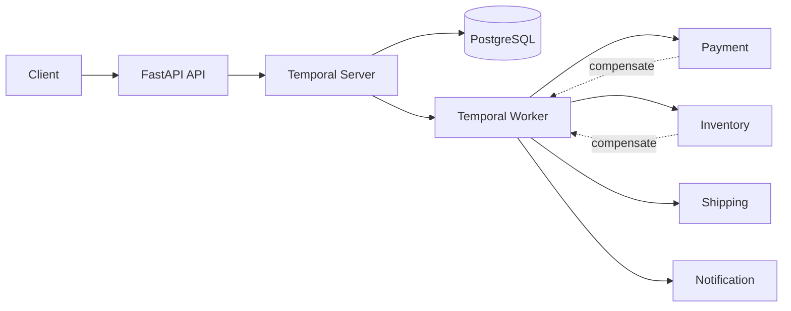

# Order Fulfillment Service

A Temporal-based order-fulfillment service that keeps multi-step workflows durable through retries, business failures, compensation, cancellation, and worker restarts.

[](https://github.com/gabbyb-cloud/order-fulfillment-temporal/actions/workflows/ci.yml)


## Overview

Order processing looks simple until one step succeeds and the next one fails. I built this project to explore how a backend can keep workflow state durable, distinguish failures that should be retried from failures that should not, and recover cleanly after partial completion or a worker crash.

The focus is not just getting an order through the happy path. It is making failure behavior explicit, testable, and predictable.

## Architecture



The API accepts requests and starts workflows. Temporal stores workflow history independently of the worker process, while the worker executes payment, inventory, shipping, and notification activities.

That separation is what allows an in-progress order to survive a worker restart without rebuilding its state from memory.

## Key design decisions

- **Workflow state lives outside the worker.** Temporal persists execution history so a process restart does not mean starting the order over.
- **Transient and business failures are treated differently.** Retryable infrastructure failures use bounded exponential backoff, while invalid cards, unavailable inventory, and invalid addresses fail without pointless retries.
- **Partial success has an explicit recovery path.** If a later activity fails, completed work is compensated in reverse order, such as releasing inventory before refunding payment.
- **Cancellation happens at safe checkpoints.** Completed work is compensated when necessary, and later activities are prevented from starting once cancellation is accepted.
- **Operational events carry execution context.** Activity events are structured so order and workflow behavior can be followed during troubleshooting.
- **Failure behavior is tested directly.** The suite covers retries, compensation, cancellation, authentication, status queries, and recovery-oriented paths instead of checking only successful requests.

## Quick start

Requirements: Docker Desktop and Git. Python 3.13 is needed only if you want to run the test suite from the host.

```bash
git clone https://github.com/gabbyb-cloud/order-fulfillment-temporal.git
cd order-fulfillment-temporal
cp .env.example .env
docker compose up --build -d
```

Once the stack is running:

- API: `http://localhost:8000`
- Temporal UI: `http://localhost:8080`

Stop everything with:

```bash
docker compose down
```

## Testing and evidence

Install the Python dependencies and run the suite:

```bash
python -m pip install -r requirements.txt
python -m pytest -q
```

The tests cover:

- successful order execution
- transient failure retries
- non-retryable business failures
- compensation after shipping failure
- cancellation after payment
- cancellation after inventory reservation
- authenticated API behavior
- workflow status queries

The important part is that failure paths are asserted as system behavior. For example, compensation tests verify that completed actions are reversed in the expected order, while cancellation tests verify that later work does not continue after a safe cancellation point.

## Tradeoffs and limits

**Worker failure:** workflow progress is stored by Temporal rather than only in worker memory. If the worker stops, workflow history remains durable and execution can continue after the worker returns.

**Transient dependency failure:** retryable failures use bounded retries with exponential backoff instead of failing the workflow immediately.

**Business failure:** conditions such as an invalid card, unavailable inventory, or invalid address are classified as non-retryable because another attempt would not change the underlying condition.

**Partial completion:** this project uses Saga-style compensating actions rather than a distributed transaction. That gives each completed step an explicit recovery action, but compensation is still business logic and is not equivalent to an atomic rollback.

**Cancellation:** cancellation is checked at controlled workflow points. This favors predictable recovery over attempting to interrupt arbitrary work at any instant.

**External services:** payment, inventory, shipping, and notification are simulated. That is intentional: the project isolates workflow durability and failure handling without depending on third-party sandboxes or credentials.

**Authentication:** the API uses an environment-configured API key. It is sufficient for this lab, but a production system would use managed identity, stronger authorization, and proper secrets management.

**Observability:** the project emits structured operational events, but it does not yet include distributed tracing, production alerting, or dependency-specific SLOs.

See [DESIGN.md](DESIGN.md) for the detailed workflow model, retry policies, compensation rules, cancellation behavior, and design tradeoffs.

## Results

These are measurements from a local run against the Docker Compose stack, not production benchmarks.

| Check | Result |
| --- | ---: |
| Automated tests | 11 passing |
| Authenticated benchmark requests | 25 / 25 successful |
| Average submission latency | 38.74 ms |
| p95 submission latency | 75.51 ms |

The benchmark used 25 sequential authenticated requests and measured **order submission latency only**. It does not represent complete workflow duration or production-scale throughput, and results will vary by hardware and system load.

## Next steps

- Add distributed tracing and production-style metrics so a single order can be followed across API, workflow, and activity boundaries.
- Strengthen idempotency around external side effects before replacing the simulated activities with real payment, inventory, or shipping integrations.
- Run larger concurrent load and recovery tests, then define SLOs from measured behavior instead of choosing targets without evidence.
